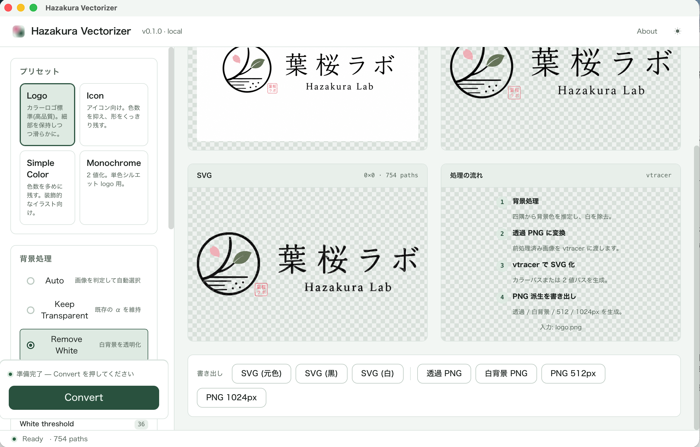

# Hazakura Vectorizer

> ローカル完結の PNG / JPG / WebP → SVG ベクター化ツール。
> 白背景除去のライブプレビューと、vtracer ベースの SVG 変換を、小さな Tauri アプリに収めました。

白背景の **ロゴ PNG** をドロップ → 透明な背景に整える → SVG と派生 PNG (透過 / 白背景 / 512px / 1024px) を書き出す、
という「素材整理」だけに振り切った macOS アプリです。
Illustrator の代替ではなく、**個人開発・LP・README 用のアセットを整える道具** として設計しています。



## 画面の見方

上のスクリーンショットは、葉桜ラボのロゴ PNG を読み込み、`Logo` プリセット + `Remove White` を当てて **Convert** を実行した直後の状態です。
ウィンドウは左サイドバー / 中央プレビューの作業画面です。左で条件を決め、中央で Original / Cutout / SVG を確認し、下部から書き出します。

| エリア | 役割 |
| --- | --- |
| **左サイドバー (プリセット / 背景処理 / ベクター化オプション)** | 作業の出発点。プリセット 1 つで cutout 条件と vtracer パラメータを一括適用。Color / Monochrome はチェックボックスで片方または両方を選べます。下部の **Convert** ボタンで SVG と PNG 派生を生成。 |
| **中央プレビュー (Original / Cutout / SVG)** | 入力画像、cutout 結果、SVG を横並びで確認。`754 paths` のように、vtracer が生成したパス数が右上に出るので、Path 数の肥大化 (= SVG の肥大化) に気付ける。Multi-mode 変換後は SVG ペインの chip で Color / Monochrome 表示を切り替えます。 |
| **下部の書き出しバー** | `SVG (元色) / SVG (黒) / SVG (白) / 透過 PNG / 白背景 PNG / PNG 512px / PNG 1024px` を保存。`全形式を書き出す` を押すと、フォルダを 1 つ選ぶだけで SVG バリアントと PNG 派生を一括出力します。 |

## 特徴

- **ローカル完結** — 画像は外部送信しません。`vtracer` バイナリもアプリに同梱。
- **ドラッグ & ドロップ** — PNG / JPG / WebP を直接ウィンドウに。Tauri の D&D イベントを直接リッスンしているので Finder からのドロップも安全。
- **白背景除去のライブプレビュー** — `Auto` / `Keep Transparent` / `Remove White` / `White Background` の 4 モード + `White threshold` / `Edge softness` / `Remove fringe` の 3 スライダー。150ms debounce で再 cutout。
- **vtracer 同梱** — `Color` / `Monochrome` 両モードで SVG を生成。v0.2.0 では両方を選んで Convert 1 回で並列生成できます。`color-precision` / `filter-speckle` / `corner-threshold` / `segment-length` / `splice-threshold` の 5 パラメータを UI から直接いじれる。
- **4 種のプリセット** — `Logo` (高精細) / `Icon` (色数を抑える) / `Simple Color` (装飾イラスト向け) / `Monochrome` (単色シルエット)。初心者はプリセットのまま Convert で OK。
- **派生アセット一括書き出し** — 透過 PNG / 白背景 PNG / 512px / 1024px と、SVG (元色 / 黒 / 白) をボタン 1 つで保存。「全形式を書き出す」を押すとフォルダ 1 つ選ぶだけで全部保存。Color と Monochrome を Convert 1 回で並列生成するオプションもあり。
- **ライト / ダークテーマ** — OS 設定連動、`localStorage` に永続化。
- **アクセシビリティ** — `role="checkbox"` / `role="switch"` / `role="tablist"` / `aria-label` / `aria-live` まで整備済み。

## ダウンロード

macOS (Apple Silicon) 用の DMG を GitHub Releases で配布しています (**developer preview** — adhoc 署名・未公証・GUI E2E 未実施)。

- 配布ページ: [Releases](https://github.com/lero003/hazakura-vectorizer/releases)
- 推奨公開バージョン: **v0.1.2** (version surfaces 同期 / 桜アイコン / `shasum -c` でチェックサム検証可能)
- 次の候補: **v0.2.0** (Multi-mode vectorize / 全形式一括書き出し / Cancel + 進捗バー)。タグ・Release 公開前は、まだ GitHub Releases には並びません。
- v0.1.0 / v0.1.1 は履歴用に不変で残してありますが、チェックサム mismatch のためダウンロードは v0.1.2 推奨です

DMG を開いたら、`Hazakura Vectorizer.app` を `/Applications` にドラッグしてください。
**初回起動時**は、Apple Silicon Mac のセキュリティ保護により、Gatekeeper が「開発元を確認できない」と警告します。
`/Applications` 上で右クリック (または Control クリック) → 「開く」を選択してください。2 回目以降はダブルクリックで起動できます。

### チェックサムの検証

```bash
# Releases ページからブラウザで 3 ファイルを同じフォルダにダウンロード
shasum -a 256 -c SHA256SUMS.txt
```

v0.1.2 では `SHA256SUMS.txt` を **GitHub ダウンロード後のファイル名 (ピリオド区切り) で記述** しているので、ブラウザでダウンロードしたそのままの名前で `shasum -c` が成功します。
`scripts/verify-release.sh` で `gh release download` 経由の検証も自動化済みです。

> Apple Developer ID での署名および公証 (notarization) は、まだ組み込まれていません。完全な公証付き配布は v0.3 以降で検討します。

## 使い方

最短ルートは **プリセット → Convert → 書き出し** の 3 ステップです。

1. **画像をドロップ** — アプリを起動し、PNG / JPG / WebP をウィンドウにドロップ (または中央をクリックして選択)。
   右下にトーストで「画像を読み込みました · WxH」と出ます。
2. **プリセットを選ぶ** — 左サイドバー上部の `Logo` / `Icon` / `Simple Color` / `Monochrome` から。
   迷ったら **`Logo`** (ロゴ全般) または **`Icon`** (小さなアイコン) を選べば、だいたい思った仕上がりになります。
3. **背景処理を切り替える** — `Auto` (四隅から背景色を推定) / `Keep Transparent` (元画像の α をそのまま使う) / **`Remove White`** (白を透明化。**ロゴ PNG ならこれ一択**) / `White Background` (白を保ったまま逆の処理)。
   ライブプレビューを見ながら `White threshold` / `Edge softness` / `Remove fringe` を微調整。
4. **Convert を押す** — サイドバー下部の大きな緑ボタン。Color / Monochrome を両方選んだ場合は、vtracer を 2 形式分並列実行します。背景処理と PNG 派生生成は convert bar に進捗が出ます。
5. **書き出し** — 下部のバーから必要な形式 (SVG 元色 / 黒 / 白、PNG 透過 / 白背景 / 512 / 1024) をクリック。`全形式を書き出す` なら、保存先フォルダを 1 回選ぶだけでまとめて保存できます。

### 仕上がりのチェックポイント

- **SVG の中央プレビューに `0x0` が出ていないか** — vtracer の失敗時は `0×0` のままになります。その画像は色数が多すぎるか白黒 2 値化前提の画像が Color モードに入っています。
- **パス数の桁数** — 数百パスはロゴ・アイコンとしては健康的。数千〜数万に膨らんだら `Filter speckle` を 4 → 8 程度に大きくしてみてください。
- **`Remove White` でロゴの白が透けた** — ロゴ本体に白が含まれているケースです。`Keep Transparent` に切り替え、元画像側の α をそのまま使うか、`White threshold` を下げてみます。

## アーキテクチャ

```
hazakura-vectorizer/
├── src/                       # React 19 + TypeScript フロントエンド
│   ├── components/            # DropZone, PreviewPane, BackgroundControls, ...
│   ├── lib/                   # cutout, pngExport, svgVariants, presets, tauriInvoke
│   └── styles/                # tokens / themes / base / app (Hazakura house style)
├── src-tauri/                 # Rust + Tauri v2 バックエンド
│   ├── src/
│   │   ├── cli/vtracer.rs     # vtracer サブプロセス ラッパ
│   │   └── commands/          # vectorize_image / read_image_file / save_dialog_and_write
│   ├── binaries/              # vtracer-aarch64-apple-darwin (Tauri externalBin)
│   └── icons/                 # 桜 + V モチーフのアプリアイコン (icns / ico / PNG 全サイズ)
├── docs/
│   ├── RELEASING.md           # リリース runbook (v0.1.0 / v0.1.1 の checksum 教训を反映)
│   └── images/                # README 用のスクリーンショット
└── .github/workflows/         # macOS ビルド & GitHub Release 公開
```

## 開発

Node 18+ / Rust stable / Tauri CLI v2 が必要です。

```bash
# 依存
npm install
npm install -g @tauri-apps/cli@latest
cargo install vtracer   # 開発時のフォールバック用 (バイナリは src-tauri/binaries/ にも同梱)

# 開発起動
npm run tauri dev

# リリースビルド (.app + .dmg)
npm run tauri build
# 成果物: src-tauri/target/release/bundle/macos/Hazakura Vectorizer.app
#        src-tauri/target/release/bundle/dmg/Hazakura Vectorizer_0.2.0_aarch64.dmg
```

## 動作環境

- macOS (Apple Silicon / aarch64)
- Tauri v2 対応 WebKit (macOS 12 以降)

Intel Mac、Linux、Windows 用のビルドは未確認です。

## 制限

- 写真など色数の多い画像は、vtracer のパス数が膨大になり巨大な SVG になりがちです。**ロゴ・アイコン用途に絞ってください**。
- `Remove White` はロゴ本体に白が含まれている場合、その部分も透明化される可能性があります。ライブプレビューで必ず確認してください。
- OCR / フォント復元 / 文字のテキスト化は行いません。画像内の文字はベクターの輪郭としてのみ出力されます。
- Adobe Illustrator 形式の `.ai` ファイルは扱いません。SVG を正規のベクター出力とします。

## 既知の小さな問題

- 開発者プレビュー扱いのため、Apple Developer ID での署名・公証は未対応です (Gatekeeper 警告が出ますが動作には影響しません)。
- スクリーンショットは README 用の静的画像なので、最新 UI と完全には一致しない場合があります。リリース前には `docs/images/screenshot-light.png` を更新してください。

## 謝辞

- Vectorization engine: [vtracer](https://github.com/visioncortex/vtracer) (Apache-2.0)
- Shell: [Tauri](https://tauri.app) (Apache-2.0 / MIT)

## ライセンス

[MIT](./LICENSE) — © 2026 Hazakura
